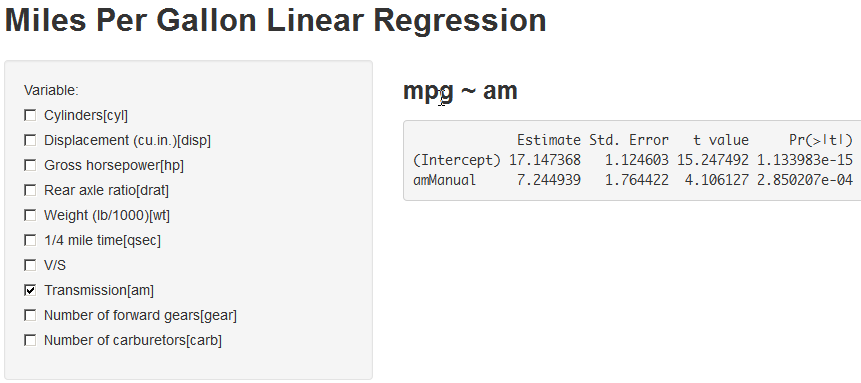

## Introduction

This app help you build the **Linear Regression Model** using p-value forward or backward selection on `mtcars` dataset.
* **variables selection**: Check the **variable** you want to include.
* **model caption**: It's showed on the main panel in bold. 
* **variables abbreviation**: It's showed after the **variable** checkbox, in the brackets.
* **coefficients summary**: Showed in main panel. The rightedst column(p-value) helps you to decide which variable you want to include.

--- .class #1

## Traditional way
You type the command int the console.
```
fit <- lm(mpg ~ factor(am), mtcars)
summary(fit)$
```

--- .class #2

## Result

```r
fit <- lm(mpg ~ factor(am), mtcars)
summary(fit)$coef
```

```
##             Estimate Std. Error t value  Pr(>|t|)
## (Intercept)   17.147      1.125  15.247 1.134e-15
## factor(am)1    7.245      1.764   4.106 2.850e-04
```


--- .class #3

## New way
Check the variables you want to included, the result show up instantly.

